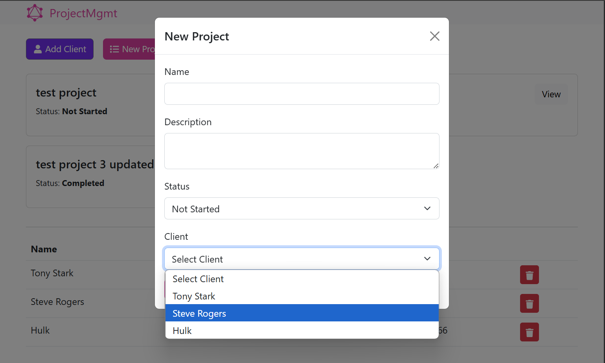

# Project Management App (MERN + GraphQL)

A full-stack project management application built with the MERN stack and GraphQL. The app allows users to manage clients and projects, supporting features like adding, updating, and deleting both clients and projects. This application uses Apollo Client on the frontend to interact with a GraphQL API on the backend.

## Table of Contents

- [Features](#features)
- [Technologies](#technologies)
- [Installation](#installation)
- [Frontend Usage](#frontend-usage)
- [Backend Usage](#backend-usage)
- [GraphQL Queries & Mutations](#graphql-queries--mutations)

## Features

- Manage clients and projects with a clear interface.
- Add, update, and delete clients and projects.
- View project details, including the client associated with each project.
- Organized into frontend (React) and backend (Node.js/Express/GraphQL) with clear separation.



## Technologies

### Frontend

- **React** 18.3.1
- **Apollo Client** 3.6.6 for GraphQL integration
- **React Router DOM** 6.3.0 for navigation

### Backend

- **Node.js** 20.11.0 and **Express** 4.18.1 for server-side development
- **Express-GraphQL** 0.12.0 for GraphQL API handling
- **Mongoose** 7.0.0 for MongoDB object modeling
- **GraphQL** 15.8.0

## Installation

### Prerequisites

- Node.js and npm
- MongoDB instance or Atlas cloud database
- Clone this repository and navigate to the project folder.

### Frontend Setup

1. Navigate to the `client` directory:

   ```bash
   cd client
   ```

2. Install the dependencies:

   ```bash
   npm install
   ```

3. Start the frontend application:

   ```bash
   npm start
   ```

### Backend Setup

1. Navigate to the `server` directory:

   ```bash
   cd server
   ```

2. Install the dependencies:

   ```bash
   npm install
   ```

3. Create a `.env` file in the `server` directory with the following variables:

   ```bash
   MONGO_URI=<Your MongoDB URI>
   ```

4. Start the backend server in development mode:

   ```bash
   npm run dev
   ```

The backend will start on `http://localhost:5000` and expose the GraphQL endpoint at `http://localhost:5000/graphql`.

## Frontend Usage

The React frontend allows users to navigate between different sections of the app, view client and project details, and interact with the GraphQL API through Apollo Client.

- **Routes**
  - `/`: Home page listing all clients and projects.
  - `/projects/:id`: Detailed view of a single project.
  - `*`: 404 Not Found page for undefined routes.

## Backend Usage

The Express server handles the GraphQL API for managing clients and projects.

### Schema

The schema defines the following types:

- **ClientType**: Represents a client with fields for `id`, `name`, `email`, and `phone`.
- **ProjectType**: Represents a project with fields for `id`, `name`, `description`, `status`, and a reference to `ClientType`.

## GraphQL Queries & Mutations

These are the GraphQL queries and mutations available:

### Queries

#### Get names of all clients

```graphql
{
  clients {
    name
  }
}
```

#### Get a single client name and email

```graphql
{
  client(id: 1) {
    name
    email
  }
}
```

#### Get name and status of all projects

```graphql
{
  projects {
    name
    status
  }
}
```

#### Get a single project name, description along with the client name and email

```graphql
{
  project(id: 1) {
    name
    description
    client {
      name
      email
    }
  }
}
```

### Mutations

#### Create a new client

```graphql
mutation {
  addClient(
    name: "Tony Stark"
    email: "ironman@gmail.com"
    phone: "955-365-3376"
  ) {
    id
    name
    email
    phone
  }
}
```

#### Delete a client

```graphql
mutation {
  deleteClient(id: 1) {
    id
  }
}
```

#### Create a new project

```graphql
mutation {
  addProject(
    name: "Mobile App"
    description: "This is the project description"
    status: "new"
    clientId: "1"
  ) {
    name
    description
  }
}
```

#### Update a project status

```graphql
mutation {
  updateProject(status: "completed") {
    name
    status
  }
}
```
